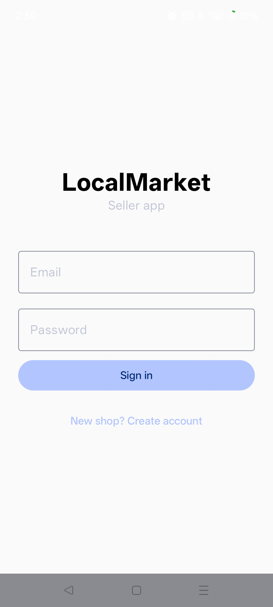
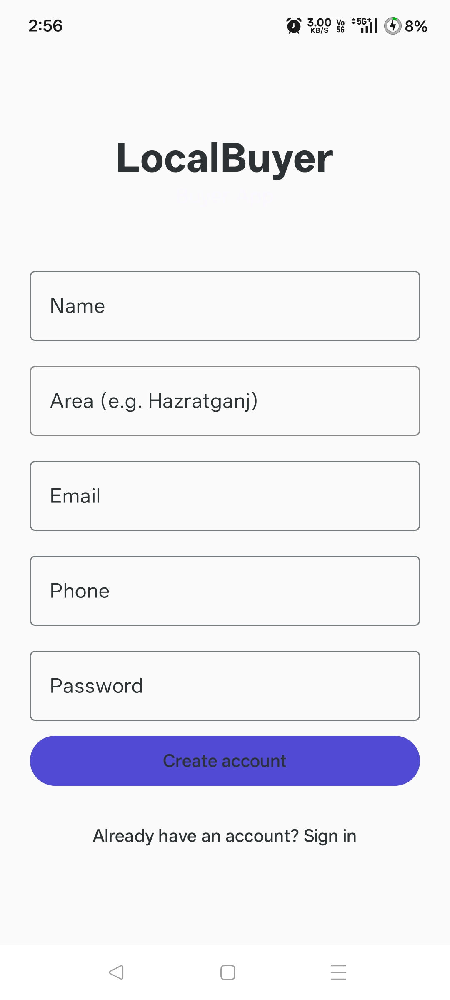
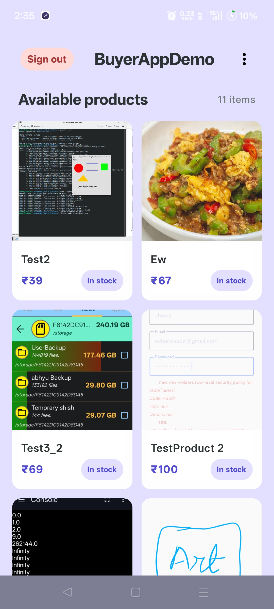
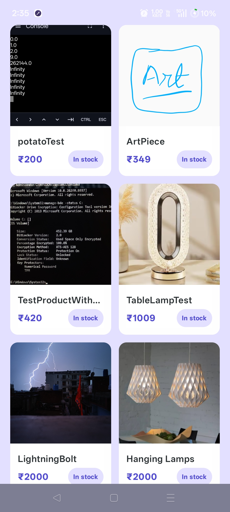
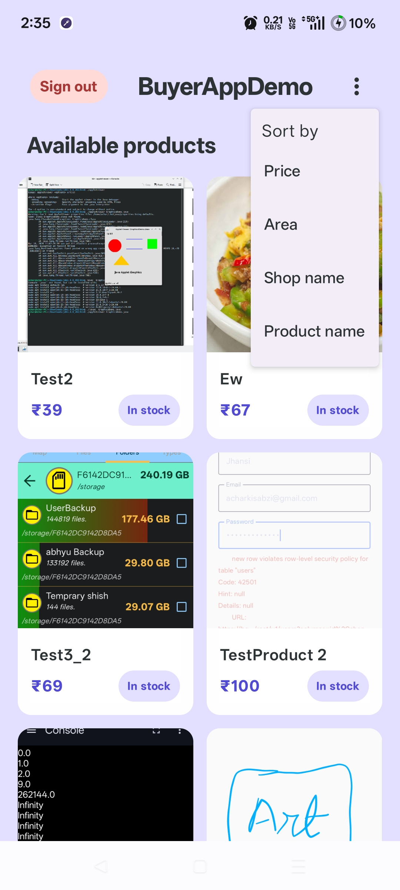
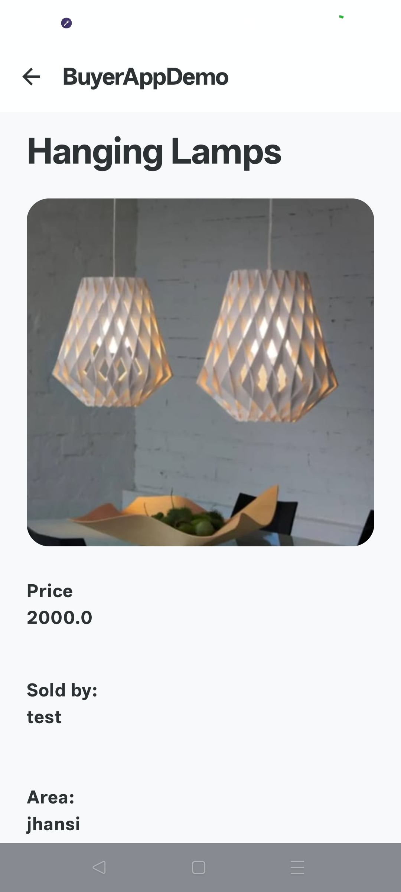
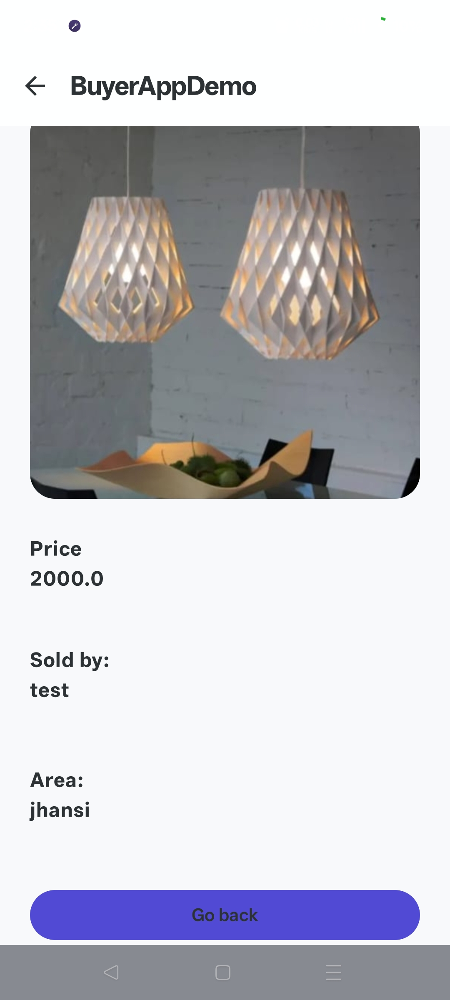

# BuyerAppDemo

An Android app that lets buyers browse and view products listed by local sellers in their area. Built as part of a two-app marketplace system alongside [SellerAppDemo](https://github.com/acharkisabzi/SellerAppDemo).

## Screenshots

**Authentication**

<p align="center">
  
  &nbsp;&nbsp;
  
</p>

**Product feed & sorting**

<p align="center">
  
  &nbsp;&nbsp;
  
  &nbsp;&nbsp;
  
</p>

**Product detail**

<p align="center">
  
  &nbsp;&nbsp;
  
</p>

## Features

- **Sign in / Sign up** - Email and password authentication with persistent session (no re-login on relaunch)
- **Product feed** - 2-column grid of all available products from local sellers, with images, prices, and stock status
- **Sort** - Sort products by price, area, shop name, or product name
- **Product detail** - Full product view with image, price, seller name, and area
- **Live backend** - All data is real-time via Supabase; products added in the Seller app appear instantly here

## Tech Stack

| Layer | Technology |
|---|---|
| UI | Jetpack Compose + Material 3 |
| Architecture | MVVM (ViewModel + StateFlow) |
| Navigation | Compose Navigation with type-safe routes |
| Backend | Supabase (Auth, Postgrest, Storage) |
| Image loading | Coil 3 |
| Language | Kotlin |

## Architecture

The app follows MVVM with a unidirectional data flow pattern:

```
LoginScreen / ProductFeedScreen / ViewProductScreen
        │
        ▼
  AuthViewModel / ProductFeedViewModel
        │
        ▼
   Supabase client (Auth + Postgrest)
```

- **UI state** is modelled as immutable data classes (`AuthUiState`, `ProductFeedUiState`)
- **StateFlow** exposes state from ViewModels; screens collect it with `collectAsState()`
- **Navigation** uses Compose Navigation - `ProductModel` is passed as a type-safe route object directly to `ViewProductScreen`
- **Session persistence** is handled by `SettingsSessionManager` so users stay logged in across app restarts

## Setup

### Prerequisites
- Android Studio Hedgehog or newer
- A Supabase project (free tier works fine)

### Supabase schema

You'll need two tables:

**`buyers`**
| column | type |
|---|---|
| id | uuid (references auth.users) |
| name | text |
| email | text |
| phone | text |
| area | text |

**`products`** (shared with Seller app)
| column | type |
|---|---|
| id | uuid |
| shop_id | uuid |
| shop_name | text |
| area | text |
| name | text |
| price | float8 |
| image_url | text |
| in_stock | boolean |

### Configuration

1. Clone the repo:
   ```bash
   git clone https://github.com/acharkisabzi/BuyerAppDemo.git
   ```

2. Add your Supabase credentials to `local.properties`:
   ```properties
   SUPABASE_URL=https://your-project.supabase.co
   SUPABASE_KEY=your-anon-key
   ```

3. Build and run on a device or emulator (API 26+).

## Related

- **[SellerAppDemo](https://github.com/acharkisabzi/SellerAppDemo)** - the companion seller-side app where shops add and manage their product listings
